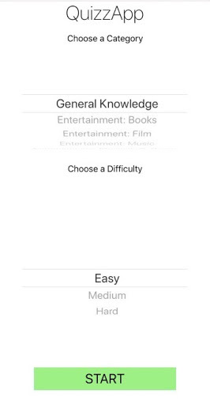
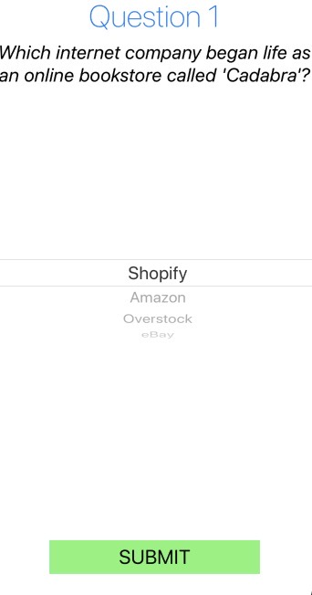
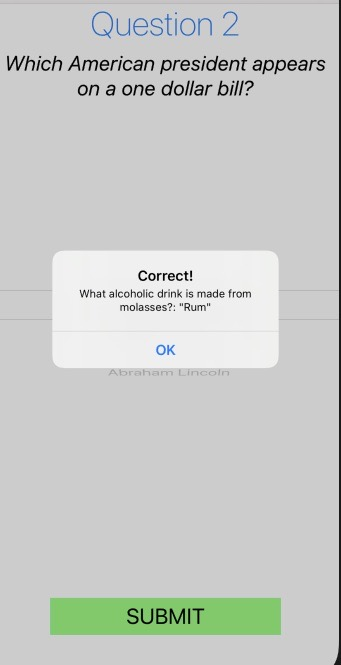
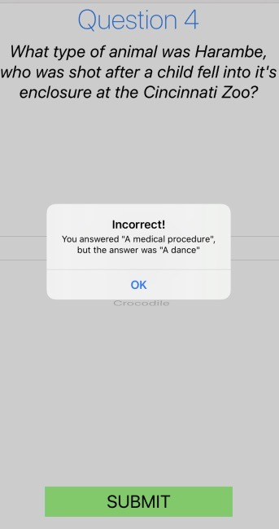
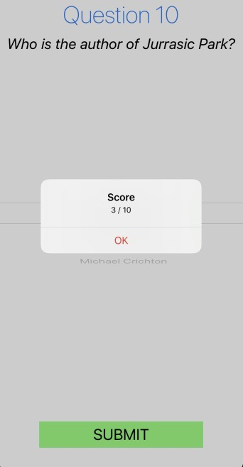

# QuizzApp,

This is an quiz app for iOS, it presents 10 questions from a category of the user's choosing, presents a list of possible answers, and prints a score at the end. The quiz API that is consumed by this application (https://opentdb.com/).

App Main Page

Quiz Question

Correct Answer

Wrong Answer

Result

